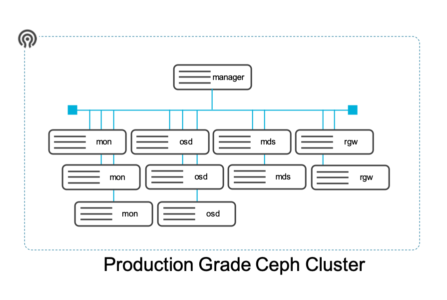

<!DOCTYPE html>
<html>
<head>
	<title>Automating Ceph Cluster Build</title>
</head>
<body>
<h2>Automating Ceph Cluster Build on IBM Cloud</h2>

The challenge was to see if it was possible to build 
a Ceph cluster that would support a dev or production environment by
providing block, file and object storage capacity to workloads running
within a Kubernetes cluster or indeed workloads just running on Cloud
virtual machines. Hence the basis for this build is "Classic Infrastructure" 
with further updates to encompass "VPC Infrastructure" planned.

Ceph is an open source software defined storage platform and is comprised
of: 
<ul>
<li>
Ceph Manager Node(s) - Any machine with network connectivity to each 
of the OSD and Mon nodes, a modern Python environment and ssh;
</li>
<li>
Ceph Monitor Nodes - The mon nodes maintain maps of the cluster state. 
This includes the monitor map, the manager map, the OSD map and the 
CRUSH map. Ceph clients request a copy of the current storage cluster 
map from the mon nodes. In a production implementation many monitors 
will exist.
</li>
<li>
Object Storage Devices (OSDs) - all storage in Ceph is object based. 
It is the OSD nodes job to interact with the servers operating system and 
storage subsystem to execute the actual writing and reading of data. It is 
the OSD node that stores data, handles data replication, recovery, rebalancing, 
and providing monitoring information to the Ceph Monitors and Managers;
</li>
<li>
Metadata Servers (MDSs) - The Metadata Server (MDS) node stores metadata 
on behalf of the Ceph filesystem, allowing POSIX file system users to execute 
simple commands like ls, find etc.;
</li>
</ul>

	The cluster this code builds can be visualised below:

<h2>Dependencies</h2>

We have approached the automation of the Ceph cluster build using Terraform 
with some supporting Linux Bash scripting. There remain though a number of 
pre-requisite or dependency actions that a future user of this automation 
approach must execute in order for the cluster to build.

<ol>
	<li>Create an IBM Cloud account with permissions to create classic infrastructure
	as a service components;
	</li>
	<li>
		Generate an API key for the classic infrastructure service;
	</li>
	<li>
		Install the SoftLayer CLI and its Python 3 dependencies;
	</li>
	<li>
		Download and install Terraform and the IBM Cloud Terraform Provider;
	</li>
	<li>
		Use SSH Keygen to create your own unique private/public key pair to replace 
		the default pair provided in this directory structure.
	</li>
</ol>

	

</body>
</html>
